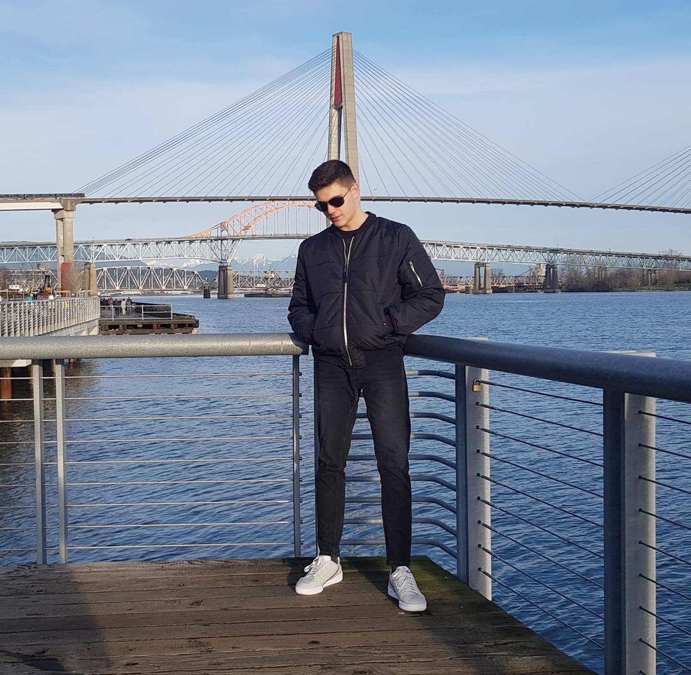

# Životopis

## Fotografija

## Osobni podatci
__Ime :__ Andrej
__Prezime :__ Mrđenović
__O meni :__ Profesionalni sam vojnik, trenutno izvanredno studiram na Sveučilištu u Zadru - Preddiplomski stručni studij
informacijskih tehnologija
__Datum rođenja :__ 21.12.1999.
__Spol :__ Muški
__Državljanstvo :__ Hrvatsko

## Kontakti
__E-adresa :__ andrej.mrdenovic@gmail.com
__Telefonski broj :__ 092-159-4549
__Društvene mreže :__
Instagram : andrejmrdenovic

## Adresa
__Adresa 1 :__ Vladimira Nazora 45
__Poštanski broj :__ 23000
__Mjesto :__ Ploče
__Zemlja :__ Hrvatska

## Radno iskustvo
__Zanimanje :__ Profesionalni vojnik
__Poslodavac :__ MORH
__Mjesto :__ Zemunik Donji
__Zemlja :__ Hrvatska

##Obrazovanje i osposobljavanje
1) __Organizacija :__ Sveučilište u Zadru - Preddiplomski stručni studij informacijskih tehnologija
__Stečena kvalifikacija :__ U tijeku
__Mjesto :__ Zadar
__Zemlja :__ Hrvatska
__Od - do :__ U tijeku
2) __Organizacija :__ Srednja škola fra Andrije Kačića Miošića
__Stečena kvalifikacija :__ Tehničar za računalstvo
__Mjesto :__ Ploče
__Zemlja :__ Hrvatska
__Od - do :__ 2014 - 2018

## Jezične vještine
__Materinski jezik :__ Hrvatski

__Strani jezik :__ Engleski
* __Razumijevanje :__ 
Slušanje : C1
Čitanje : C1
* __Govor :__
Govorna interakcija : B2
Govorna produkcija : B2
* __Pisanje :__ A2

## Digitalne vještine

Uredsko poslovanje | Osnove programskih jezika | Sustavi za verzioniranje i suradnički rad
-------- | -------- |--------------
Excel | Python | Git
Word | N/A | GitHub
PowerPoint | N/A | Google Drive

## Vozačka dozvola
Motockili | Automobili
---|---
AM | B